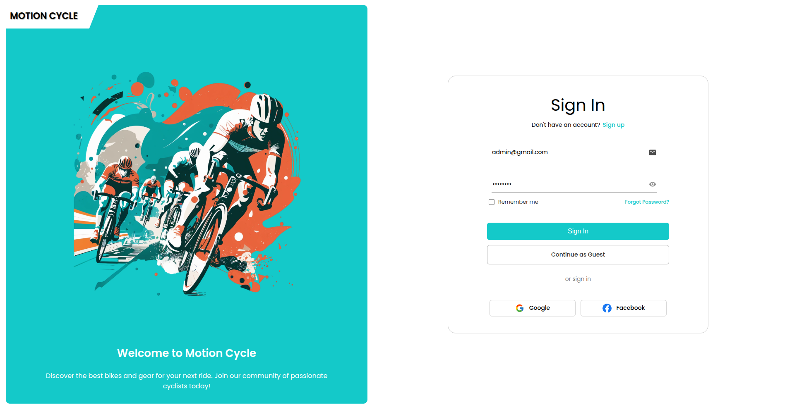
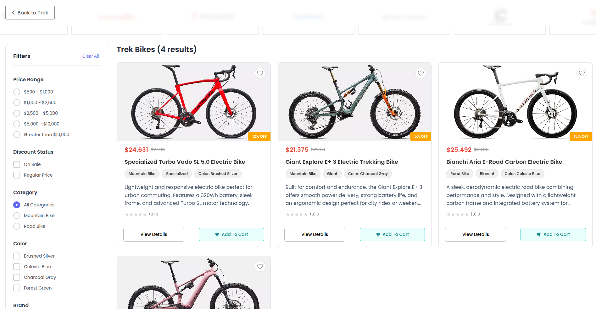
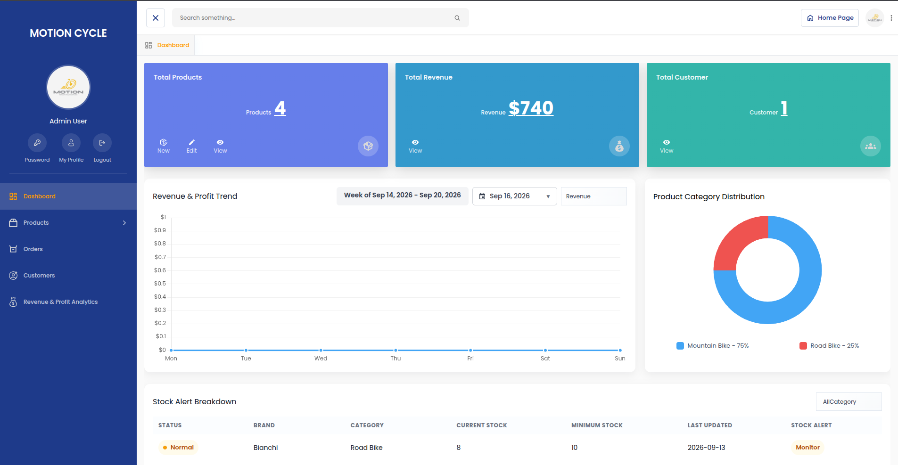

# Motion Cycle Platform

Motion Cycle is a full-stack electric-bike commerce platform with a customer storefront and a responsive administration workspace. It supports product discovery, shopping, order and payment tracking, reviews, discounts, stock management, and operational analytics.

## Screenshots

### Sign In



### Storefront Catalog



### Administration Dashboard



## Highlights

- Customer storefront for browsing bike products, brands, categories, product details, ratings, and reviews.
- Secure authentication with customer and administrator roles.
- Cart, favorites, checkout, order history, and order status tracking.
- KHQR / Bakong payment QR generation and payment-status verification.
- Product feedback and review workflows, including guest reviews.
- Admin dashboard with product, revenue, customer, category, and low-stock reporting.
- Administration tools for products, discounts, inventory, customer records, orders, reviews, and analytics.
- Mobile-responsive administration layout, forms, dialogs, navigation, tabs, charts, and data records.

## Stack

| Layer | Technology |
| --- | --- |
| Frontend | Vue 3, Vite, Pinia, Vue Router, Axios, Chart.js, Iconify |
| Backend | Laravel 11, PHP 8.2+, Laravel Sanctum |
| Database | PostgreSQL 15 (Docker) or a Laravel-configured database |
| Payments | KHQR / Bakong gateway integration |
| Containers | Docker Compose and Nginx |

## Repository Layout

```text
.
├── frontend/       # Vue storefront and administrator interface
├── backend/        # Laravel REST API, migrations, models, and seeders
├── docs/images/    # Documentation assets
├── docker-compose.yml
└── nginx.conf
```

## Quick Start

### 1. Configure the backend

```bash
cd backend
composer install
cp .env.example .env
php artisan key:generate
```

Configure the database values in `backend/.env`, then migrate and seed it:

```bash
php artisan migrate --seed
php artisan serve
```

The API is available at `http://localhost:8000` by default.

### 2. Start the frontend

```bash
cd frontend
npm install
npm run dev
```

Open `http://localhost:5173`.

Set `VITE_API_BASE_URL` in `frontend/.env` when the API is hosted elsewhere:

```env
VITE_API_BASE_URL=http://localhost:8000/api
```

### 3. Run with Docker

```bash
docker compose up --build
```

Docker exposes Nginx at `http://localhost:8100` and PostgreSQL at port `5437`.

## Test Account

The database seeder creates an administrator account for local testing:

| Field | Value |
| --- | --- |
| Username | `admin` |
| Email | `admin@gmail.com` |
| Password | `admin123` |
| Role | `admin` |

The sign-in form is prefilled with the seeded email and password in the development UI. Seed credentials are for local development only; replace them before deployment.

## Core Workflows

### Customer Experience

1. Browse products, brands, categories, and detailed bike specifications.
2. Save favorites or add products to the cart.
3. Complete checkout with an order and KHQR payment flow.
4. Monitor payment and order status from the order-history area.
5. Submit and read product reviews.

### Administration

1. Sign in with an administrator account to access `/admin`.
2. Monitor dashboard KPIs, revenue trends, category distribution, and stock alerts.
3. Create, edit, discount, restock, or remove products.
4. Review orders, customers, feedback, and discount codes.
5. Use responsive mobile views for forms, tables, charts, navigation, and profile management.

## API Areas

The Laravel API provides endpoints for:

- Authentication: registration, login, logout, token refresh, and current-user details.
- Products and public catalog browsing.
- Categories, cart items, favorites, product reviews, and discount-code validation.
- Orders, payment confirmation, and order status updates.
- KHQR QR creation, decoding, verification, and payment-status checks.
- Administrator product, order, review, discount, customer, and dashboard operations.

Route definitions are available in [backend/routes/api.php](backend/routes/api.php).

## Useful Commands

```bash
# Frontend
cd frontend
npm run dev
npm run build

# Backend
cd backend
php artisan migrate --seed
php artisan test

# Docker
docker compose up --build
docker compose down
```

## License

This project is available under the MIT License.
